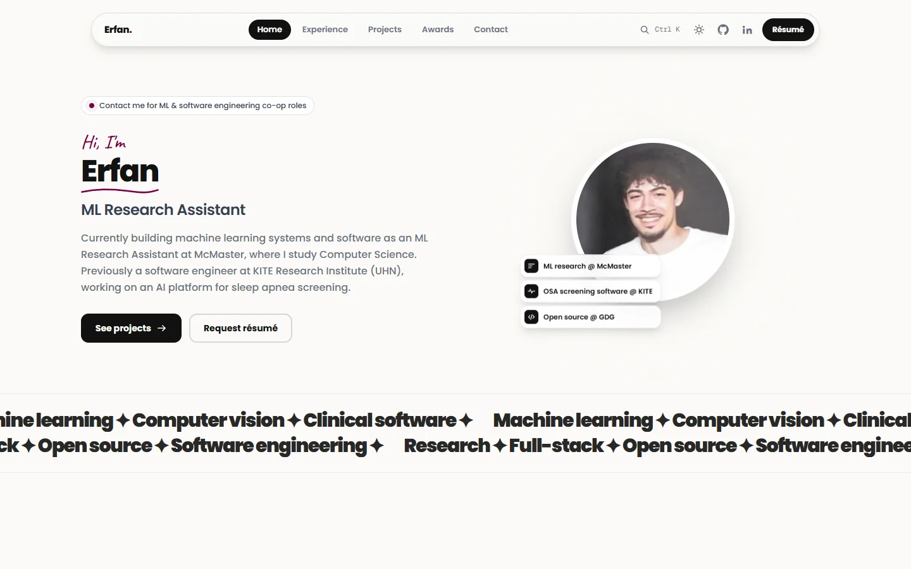
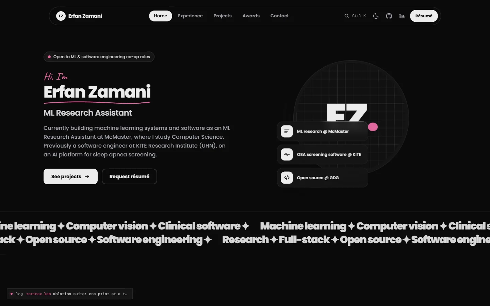
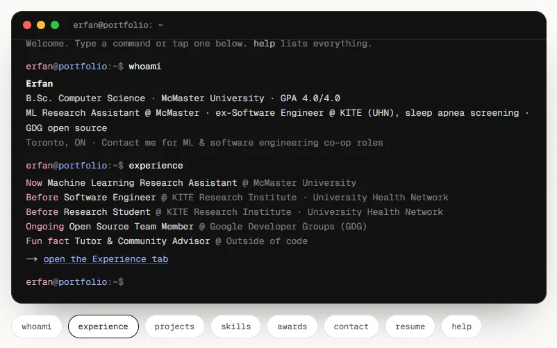
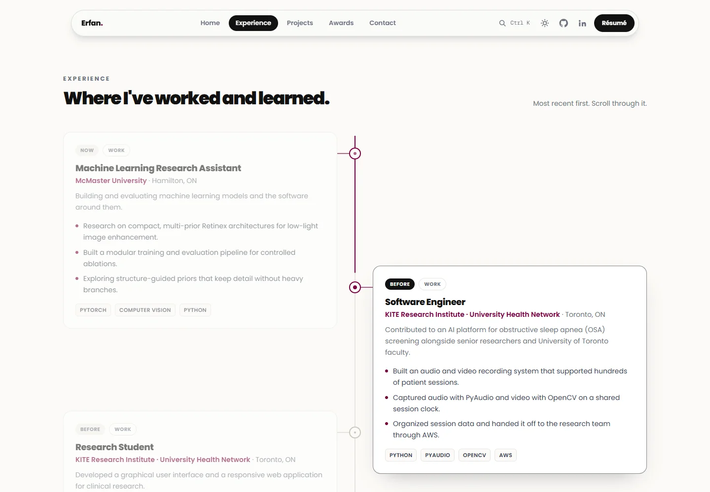
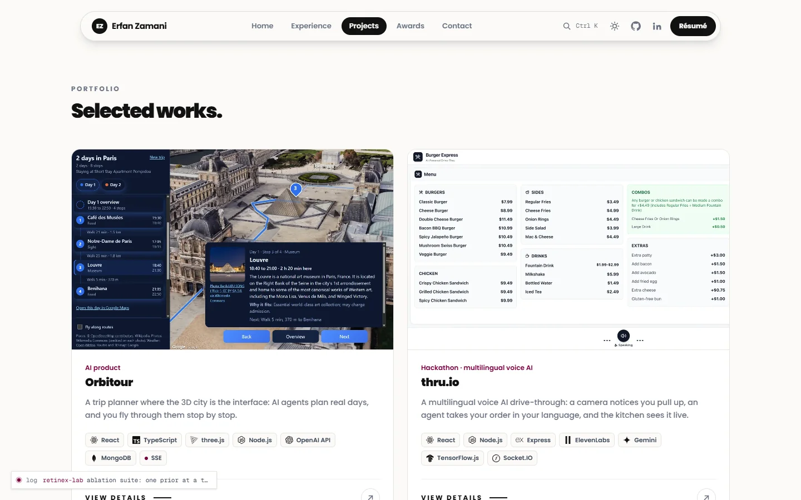
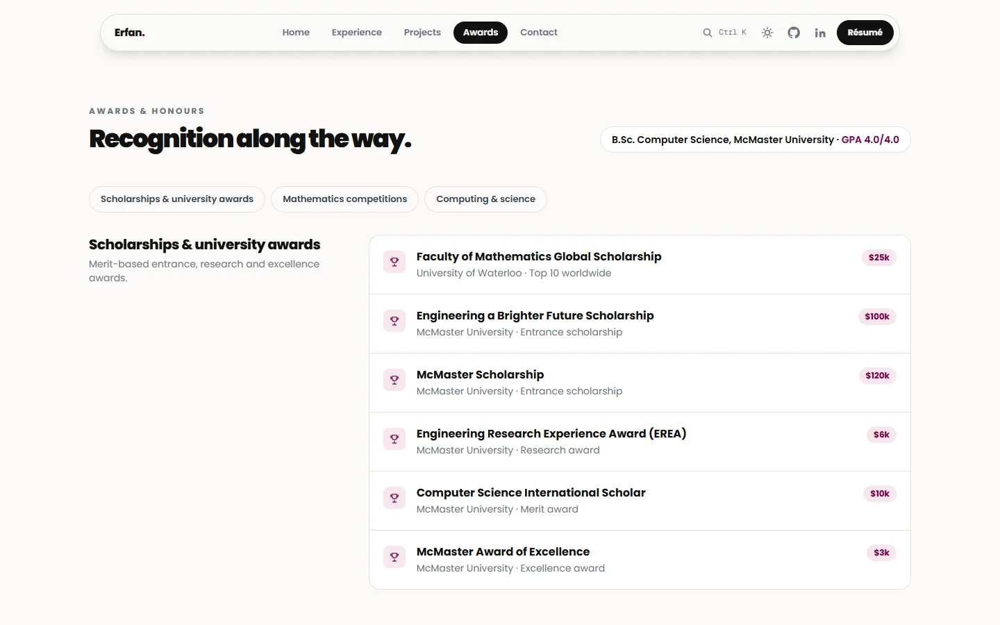

<div align="center">

# Erfan Zamani

**ML Research Assistant at McMaster University · Software Engineer**

Computer Science at McMaster. I build machine learning systems and the software around them, from research at McMaster to an AI sleep apnea screening platform at KITE Research Institute (UHN).

[](https://nextjs.org)
[](https://react.dev)
[](https://www.typescriptlang.org)
[](https://tailwindcss.com)
[](LICENSE)

[LinkedIn](https://www.linkedin.com/in/erfan-zamani1/) · [GitHub](https://github.com/Erunixz) · [Email](mailto:zamane1@mcmaster.ca)

<br />




</div>

<br />

## About this site

My personal portfolio: where I've worked, what I've built and what I've been recognized for, in a site that's quick to scan and fun to explore.

| | |
| --- | --- |
| **Tabs** | Home, Experience, Projects, Awards and Contact, one click apart. |
| **Interactive terminal** | Type `whoami`, `experience`, `projects`, `skills`, `awards` or `open orbitour`. Tab autocompletes, ↑ and ↓ walk history, and every command also has a button. |
| **Experience timeline** | A centre line that fills as you scroll, with roles alternating on either side. |
| **Project case studies** | Real screenshots with a full-screen viewer, architecture diagrams that draw themselves, and each project's stack. |
| **Résumé on request** | Leave your email and the résumé arrives in your inbox automatically. |
| **Command palette** | `Ctrl K` / `⌘ K` jumps to any page, project or link. |
| **Light and dark themes** | Follows your system setting and remembers your choice. |
| **Built for every screen** | Prerendered pages, keyboard navigation, reduced-motion support and a layout that works on phones. |

<table>
  <tr>
    <td width="50%"></td>
    <td width="50%"></td>
  </tr>
  <tr>
    <td align="center"><sub>The terminal</sub></td>
    <td align="center"><sub>The experience timeline</sub></td>
  </tr>
  <tr>
    <td width="50%"></td>
    <td width="50%"></td>
  </tr>
  <tr>
    <td align="center"><sub>Projects</sub></td>
    <td align="center"><sub>Awards & honours</sub></td>
  </tr>
</table>

## Featured projects

**[Orbitour](https://github.com/Erunixz/Orbitour)**: a trip planner where the 3D city is the interface. Code tools and two AI agents plan day-by-day trips from verified places, and you fly through them over photorealistic 3D tiles.

**[thru.io](https://devpost.com/software/thru-ai)**: a multilingual voice AI drive-through built at GDG McMaster Mac-a-Thon 2026, with camera-triggered ordering and a live kitchen display.

## Built with

| Area | Tools |
| --- | --- |
| Framework | Next.js 16 (App Router), React 19, TypeScript |
| Styling | Tailwind CSS 4, Poppins, Geist Mono |
| Motion | `motion` for the tab indicator, dialogs and the scroll-linked timeline |
| Email | Nodemailer for the contact form and résumé requests |
| Icons | [Simple Icons](https://simpleicons.org) |

## Running locally

```bash
git clone https://github.com/Erunixz/Portfolio.git
cd Portfolio
npm install
npm run dev
```

## License

[MIT](LICENSE) © Erfan Zamani
